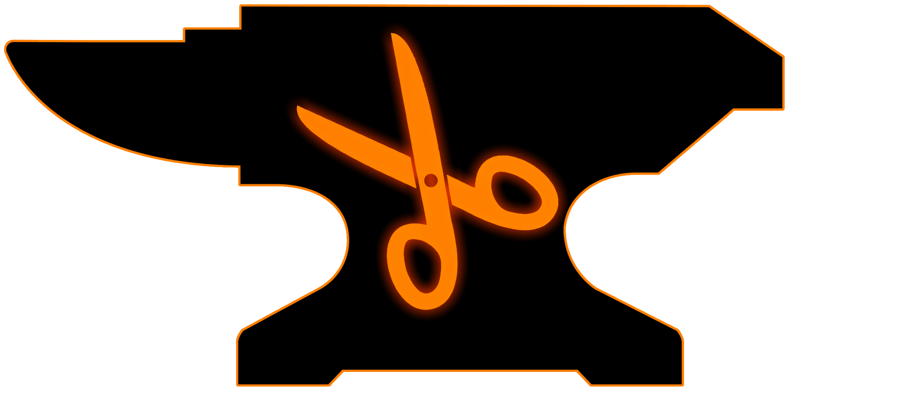

  

  <h3 align="center">RotoForge AI</h3>

  RotoForge is an implementation of [SAM-HQ](https://github.com/SysCV/sam-hq/tree/main) + some other custom stuff to make rotoscoping fast af
   
   
  <a href="https://github.com/MagnumVD/RotoForge-AI/issues/new?assignees=&labels=bug">Report a Bug</a>
  ·
  <a href="https://github.com/MagnumVD/RotoForge-AI/issues/new?assignees=&labels=enhancement">Request a Feature</a>
  ·
  <a href="https://github.com/MagnumVD/RotoForge-AI/issues/new?assignees=&labels=question">Ask a Question</a>
   

  
  
  

  
  
  [-@MagnumVD__-black?style=flat&logo=x)](https://x.com/MagnumVD_/)
  

## What can it do? (About):

Rotoforge generates bitmasks (grayscale images which show how much a pixel is part of a mask) based on prompts which the user provides. It can both generate masks for images and videos.  
During this process you have multiple methods of fixing/adjusting incorrect masks.

### Different mask prompts:

The AI is prompted via mask splines which you (the user) draws on the image.  
Currently it treats all splines as poly splines because I need to write my own conversion script, that will be fixed in the future.

You can change the prompt type per spline either manually by changing it's property or by using the 'Active Spline Settings' block in the menu where all settings are in one place.

* For closed/cyclic masks the encapsulated area is prompted. It is always recommended because with that info the output and performance are improved drastically.
* For open masks every control point is counted as a prompt. 
    * Points part of a spline with fill are inclusion points and counted positive. (put those into areas you want filled)
    * Points part of a spline without fill are exclusion points and counted nagative. (put those into areas which you don't want filled)

## Installation

### Prerequisites

You need [Blender 4.2 or higher](https://blender.org) to install addons. Windows and Linux are supported.

You can learn more about the requirements under [Versions and compatibility](#versions-and-compatibility)

### Download
Head over to [Releases](https://github.com/MagnumVD/RotoForge-AI/releases) for a stable ZIP.  
Alternatively you can just download the [current source code](https://github.com/MagnumVD/RotoForge-AI/archive/refs/heads/main.zip) - it's probably not bugfree, but you do get access to the latest features.

### Install the ZIP folder in Blender

Go to `Edit` -> `Preferences`. And select `Add-ons` in the left bar. Under the small arrow at the top right, click the `Install from Disk...` button.  
Select the ZIP file you just downloaded and click `Install from Disk`. After the
installation finishes, check the checkbox next to the `RotoForge-AI` addon.

### Install the dependencies

Iin the drop down menu under the addon, you can set an `Install path`, then run `Check Dependencies`. After that you can use the `Install` button to automatically download and install the requred dependencies.  
This can take a little bit of time since it's ~8GB of data and will freeze blender.  
I recommend you **open up the system console window before you start the download/installation process**, that way you can track it's progress.

Due to restrictions by the OS, in order to update dependencies, you have to **manually delete the dependencies folders** in the `Install path`, and then open blender and install the dependencies again.

Now, you can find RotoForge in your **image editor** in the masking tab.

### Useful info here (tips and tricks):

* As a rule of thumb: **Less is more!** Don't go overboard with prompts or the quality will suffer. I normally use 1 closed mask + 2 positive/negative prompt points each.

* The base model is really dumb and not the fastest, **use the light or large model** instead.
The large model is generally my go-to, but sometimes the light or huge models come in handy.

* If you have 1min to spare, just animate your prompts (input masks) loosely and **check the manual tracking option**. The automatic tracking does work pretty nice, but with manual tracking you can help it with concave shapes by adding additional prompt points as the tracking is purely boundary based (for now).

* Blenders tracking for open mask splines (prompt points) is **not supported**.

* If there are some individual frames which you want to edit/fix, you can use the paint mode in the image editor. It works with image sequences (don't forget to save the image).

## Versions and compatibility

### Hardware
This addon was originally created for Windows operating systems with Nvidia cards which support CUDA acceleration.
However since 1.0.2 linux is supported as well.  
In addition to that, there is a CPU fallback if you don't have a GPU with CUDA capabilities.

In order to learn about the required memory: The following tests were performed with an Nvidia GeForce RTX 2070 Max-Q, the dedicated Memory and GPU Memory of the machine were both tracked during the mask generation process.

| Used Model    | Dedicated Memory | GPU Memory | Estimated model usage |
| ------------- |:----------------:|:----------:|:---------------------:|
| None (idle)   | 0.8GB            | 0.6GB      | *baseline*            |
| light         | 1.1GB            | 0.9GB      | 0.3GB                 |
| base          | 3.9GB            | 3.7GB      | 3.1GB                 |
| large         | 5.6GB            | 5.4GB      | 4.8GB                 |
| huge          | 7.0GB            | 6.8GB      | 6.2GB                 |

### Blender versions
The addon was tested with the following blender versions:

* 4.2 
* 4.3 

Custom blender forks probably work, I just didn't test them.

## Roadmap

See the [open issues](https://github.com/MagnumVD/RotoForge-AI/issues) for a list of proposed features (and known issues).  

- [Top Feature Requests](https://github.com/MagnumVD/RotoForge-AI/issues?q=label%3Aenhancement+is%3Aopen+sort%3Areactions-%2B1-desc) (Add your votes using the 👍 reaction)
- [Top Bugs](https://github.com/MagnumVD/RotoForge-AI/issues?q=is%3Aissue+is%3Aopen+label%3Abug+sort%3Areactions-%2B1-desc) (Add your votes using the 👍 reaction)
- [Newest Bugs](https://github.com/MagnumVD/RotoForge-AI/issues?q=is%3Aopen+is%3Aissue+label%3Abug)

# Support

Reach out to me at one of the following places:

- Join the [Discord](https://discord.com/invite/bjUa77XHak) for the fastest support.
- [GitHub issues](https://github.com/MagnumVD/RotoForge-AI/issues/new?assignees=&labels=question)
- Other contact options are listed under [my GitHub profile](https://github.com/MagnumVD)

# Contributing

First of, thanks for taking the time to contribute! Contributions are what make the open-source
community such an amazing place to learn, inspire, and create. Any contributions you make will
benefit everybody else and are **greatly appreciated**.

Please read [the contribution guide](docs/CONTRIBUTING.md), thank you for being involved!

## License

RotoForge AI as a whole is licensed under the GNU General Public License, Version 3. 
Individual files may have a different, but compatible license.
